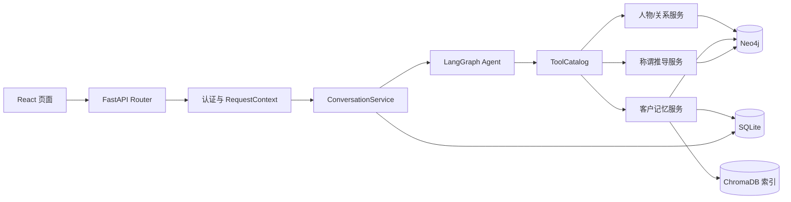

# AI 人际关系助手：目标代码框架

> 更新日期：2026-09-21。
> 这是一份改造蓝图，不代表列出的文件已经实现。请按文末迁移顺序逐步创建，不要一次建立所有空目录。
> 业务函数的中文实现提示位于 [scaffolds](scaffolds/README.md)。

## 1. 改造后的主链路



每层只承担一种责任：

- Router：解析 HTTP、取得认证身份、调用应用服务、转换响应。
- Service：组织业务流程和事务，不拼提示词、不直接相信模型参数。
- Repository：执行具体存储操作，在数据库边界强制 owner 条件。
- Tool：把 Agent 请求转换为领域服务调用，不承载核心业务规则。
- Agent：决定下一步动作；身份、授权、数据库一致性由确定性代码控制。
- Prompt/Model Adapter：模型输入输出转换和结构校验，不直接写数据库。

## 2. 建议目录

`[现有]` 表示可以先在原文件中改；`[新增]` 表示在对应任务开始时创建。

```text
backend/
├── main.py                              [现有] 应用创建、lifespan、路由注册
├── config.py                            [现有] 只定义经过校验的配置
├── auth.py                              [现有] JWT 与密码；逐步移出数据库细节
│
├── models/
│   ├── domain.py                        [新增] RequestContext、PersonRef、领域错误
│   └── schemas.py                       [现有] HTTP 请求/响应模型
│
├── repositories/
│   ├── user_repository.py               [新增] User 与 self_person_id
│   ├── person_repository.py             [新增] owner 约束的人物 CRUD
│   ├── relation_repository.py           [新增] owner 约束的关系与候选路径
│   ├── memory_repository.py             [新增] 事实版本与证据关联
│   └── conversation_repository.py       [新增] SQLite 会话、消息、幂等请求
│
├── db/
│   ├── neo4j_client.py                  [现有] 连接和底层查询，逐步变薄
│   ├── chroma_client.py                 [现有] 可重建索引读写
│   └── sqlite.py                        [新增] SQLite 连接、迁移和事务入口
│
├── services/
│   ├── access.py                        [新增] 可信上下文与归属校验
│   ├── person_service.py                [新增] 人物与关系用例
│   ├── conversation_service.py          [新增] 会话加载、保存和请求幂等
│   ├── confirmation_service.py          [新增] 待确认动作与一次性消费
│   ├── llm.py                           [现有] 模型适配器
│   └── embedding.py                     [现有] 向量模型适配器
│
├── memory/
│   ├── models.py                        [新增] SourceMessage、MemoryFact、EvidenceRef
│   ├── import_service.py                [新增] 单一 JSON 聊天导入
│   ├── fact_service.py                  [新增] 提取、校验、更正和版本
│   ├── retrieval.py                     [新增] owner/person 过滤与权威回查
│   └── brief_service.py                 [新增] 有引用的客户概况与建议
│
├── kinship/
│   ├── models.py                        [新增] TraversalStep、KinshipResult
│   ├── path_service.py                  [新增] 有界亲属候选路径
│   └── reasoning.py                     [新增] 方向归一化、规则和结果合并
│
├── tools/
│   ├── contracts.py                     [新增] ToolSpec、ToolCall、ToolResult
│   ├── args.py                          [新增] Pydantic 工具参数
│   ├── catalog.py                       [新增] 唯一 ToolSpec 集合
│   ├── person.py                        [现有] 逐步改为薄适配器
│   ├── relation.py                      [现有] 逐步改为薄适配器
│   ├── customer_memory.py               [新增] 客户记忆和沟通准备工具
│   └── kinship.py                       [现有] 最终改为调用 kinship service
│
├── agent/
│   ├── contracts.py                     [新增] NextDecision、Observation、PendingAction
│   ├── state.py                         [现有] 只保存一次 turn 所需状态
│   ├── graph.py                         [现有] 只描述节点与路由
│   ├── nodes/
│   │   ├── decide_next.py               [新增] 每次只决定一个下一步
│   │   ├── execute_one.py               [新增] 执行一个经过校验的 ToolCall
│   │   ├── clarify.py                    [新增] 返回结构化澄清问题
│   │   └── finalize.py                   [新增] 组织最终回复与引用
│   └── prompts/
│       ├── decision.py                   [新增] 下一步决策提示词
│       ├── memory.py                     [新增] 事实提取/建议提示词
│       └── response.py                   [新增] 最终回复提示词
│
├── routers/
│   ├── auth.py                          [现有]
│   ├── chat.py                          [现有]
│   ├── conversations.py                 [新增]
│   ├── imports.py                       [新增]
│   └── confirmations.py                 [新增]
│
└── jobs/
    └── reindex_facts.py                 [新增] 重放待同步事实索引

tests/
├── auth/
├── db/
├── tools/
├── conversations/
├── memory/
├── agent/
├── kinship/
└── fixtures/
```

第一周不要立即拆分 `neo4j_client.py`。先补测试和 owner 参数，再把稳定的查询逐个迁到 Repository；这样每次迁移后应用仍可运行。

## 3. 最核心的公共对象

### 3.1 可信请求上下文

```python
@dataclass(frozen=True)
class RequestContext:
    user_id: str          # 已认证 User ID，也是数据 owner
    self_person_id: str   # 当前用户关系图中的本人 Person ID
    request_id: str       # 日志和请求幂等关联
```

构造规则：

```python
async def build_request_context(
    request_id: str,
    current_user: AuthenticatedUser = Depends(get_current_user),
    access_service: AccessService = Depends(get_access_service),
) -> RequestContext:
    # current_user 来自服务端认证；请求体不再携带 user_id。
    # access_service 读取显式 self_person_id，校验 Person 仍属于该 user。
    # 缺映射时返回待绑定错误，不能把 user_id 填成 person_id。
    ...
```

所有业务服务和工具的第一个参数都是 `ctx: RequestContext`。任何函数如果同时收 `ctx` 和可由客户端指定的 `owner_id`，说明边界设计有问题。

### 3.2 统一领域错误

```python
class ErrorCode(StrEnum):
    INVALID_ARGUMENT = "invalid_argument"
    NOT_FOUND_OR_FORBIDDEN = "not_found_or_forbidden"
    AMBIGUOUS = "ambiguous"
    CONFLICT = "conflict"
    NEEDS_CONFIRMATION = "needs_confirmation"
    TEMPORARY_FAILURE = "temporary_failure"
    STEP_LIMIT_REACHED = "step_limit_reached"

class DomainError(Exception):
    def __init__(self, code: ErrorCode, safe_message: str, *, retryable: bool = False):
        ...
```

Repository 不抛 HTTPException；Router 才负责把领域错误转换成 HTTP 状态。不存在和异主资源统一使用 `NOT_FOUND_OR_FORBIDDEN`，防止泄露其他用户是否保存了某人。

### 3.3 工具调用与结果

```python
@dataclass(frozen=True)
class ToolCall:
    call_id: str
    name: str
    arguments: dict[str, object]  # 只有模型可提供字段
    operation_id: str | None      # 服务端生成，写操作幂等

@dataclass(frozen=True)
class ToolResult:
    call_id: str
    name: str
    ok: bool
    code: ErrorCode | None
    message: str
    data: dict[str, object]
    retryable: bool
```

不要保留 `msg`/`message` 两套字段，也不要根据中文文案决定是否重试。

## 4. 账户、Person 与 owner

### 4.1 图模型

```text
(:User {
  user_id,
  phone_number,
  hashed_password,
  self_person_id,
  created_at
})

(:Person {
  id,
  owner_id,
  name,
  gender,
  birth_year,
  ...
})

(:Person)-[:RELATION {
  id,
  owner_id,
  type,
  note,
  created_at
}]->(:Person)
```

最低约束：

- `User.user_id`、`User.phone_number`、`Person.id` 唯一。
- User 的 `self_person_id` 必须指向同 owner 的 Person。
- 一条 RELATION 的 owner、起点 owner、终点 owner 必须一致。
- `through_person_id` 存 ID，不存易变姓名；存在时也必须同 owner。

### 4.2 Repository 接口

```python
class PersonRepository(Protocol):
    def get(self, *, owner_id: str, person_id: str) -> Person | None: ...
    def search_by_name(self, *, owner_id: str, query: str, limit: int) -> list[Person]: ...
    def create(self, *, owner_id: str, data: CreatePerson, operation_id: str) -> Person: ...
    def update(self, *, owner_id: str, person_id: str, changes: UpdatePerson) -> Person: ...
    def delete(self, *, owner_id: str, person_id: str) -> bool: ...

class RelationRepository(Protocol):
    def create(self, *, owner_id: str, data: CreateRelation, operation_id: str) -> Relation: ...
    def update(self, *, owner_id: str, relation_id: str, changes: UpdateRelation) -> Relation: ...
    def delete(self, *, owner_id: str, relation_id: str) -> bool: ...
    def list_for_person(self, *, owner_id: str, person_id: str) -> list[RelationView]: ...
```

预检查用于改善错误信息，最终 Cypher 仍必须原子匹配 owner。例如更新人物：

```cypher
MATCH (p:Person {id: $person_id, owner_id: $owner_id})
SET p += $allowed_changes
RETURN p
```

动态字段白名单在 Python 中生成；属性值必须继续使用参数，不能拼进查询文本。

## 5. 会话与确认状态

### 5.1 SQLite 表

```text
conversation(
  thread_id PK,
  owner_id,
  created_at,
  updated_at
)

message(
  message_id PK,
  thread_id,
  owner_id,
  role,
  content,
  request_id,
  created_at,
  UNIQUE(owner_id, request_id, role)
)

pending_action(
  action_id PK,
  owner_id,
  thread_id,
  tool_name,
  normalized_args_json,
  args_hash,
  operation_id UNIQUE,
  status,
  expires_at,
  result_json
)
```

`thread_id` 和 `action_id` 都只是选择器，不是权限凭证。查询必须同时匹配 owner。

### 5.2 Chat Router

```python
class ChatRequest(BaseModel):
    message: str = Field(min_length=1, max_length=4000)
    thread_id: UUID
    request_id: UUID

@router.post("/chat")
def chat(
    body: ChatRequest,
    ctx: RequestContext = Depends(build_request_context),
    service: ConversationService = Depends(get_conversation_service),
) -> ChatResponse:
    return service.run_turn(ctx=ctx, command=body)
```

响应至少包含：`thread_id`、`request_id`、最终状态、文本、引用、澄清选项或待确认动作。前端不再发送 user_id、owner_id、history、confirmed。

### 5.3 确认流程

```text
Agent 提议删除
  -> 服务端保存 PendingAction(status=pending)
  -> 返回 action_id 和人类可读摘要
  -> 用户点击确认
  -> POST /confirmations/{action_id}
  -> 按 owner+thread+action 原子消费
  -> 使用保存的参数执行一次
```

用户确认请求不能重新提交工具参数。重复确认依靠相同 operation_id 返回原结果。

## 6. 客户记忆模型

### 6.1 原始记录在 SQLite

```text
source_message(
  message_id PK,
  owner_id,
  person_id,
  source_id,
  external_message_id,
  speaker_role,
  sent_at,
  text,
  content_hash,
  UNIQUE(owner_id, source_id, external_message_id)
)
```

### 6.2 事实版本在 Neo4j

```text
(:MemoryFact {
  fact_id,
  owner_id,
  person_id,
  category,
  value,
  status,              // active/superseded/pending_confirmation/rejected
  version,
  supersedes_fact_id,
  valid_from,
  valid_to,
  index_status,        // pending/ready/failed
  operation_id
})
```

事实通过 `evidence_message_ids` 或 Evidence 关联指回 SQLite 消息。跨存储没有单一事务，因此采用下面的恢复协议：

```text
1. SQLite 原始消息事务提交
2. Neo4j 事实版本 + index_status=pending 事务提交
3. 后台任务把 active 事实 upsert 到 Chroma
4. 仅当事实版本仍是最新时，更新 index_status=ready
5. 检索命中向量后回查 Neo4j，只使用 active 最新版本
```

Chroma 丢失可以重建；原始消息和事实版本不能依赖 Chroma 恢复。

### 6.3 记忆服务接口

```python
class MemoryService:
    def import_batch(self, *, ctx: RequestContext, person_id: str, batch: ImportBatch) -> ImportResult: ...
    def extract_candidates(self, *, ctx: RequestContext, message_ids: list[str]) -> list[FactCandidate]: ...
    def accept_candidate(self, *, ctx: RequestContext, candidate: FactCandidate, operation_id: str) -> MemoryFact: ...
    def correct_fact(self, *, ctx: RequestContext, old_fact_id: str, replacement: FactCandidate, operation_id: str) -> MemoryFact: ...
    def retrieve(self, *, ctx: RequestContext, person_id: str, query: str, limit: int) -> list[MemoryHit]: ...
    def prepare_brief(self, *, ctx: RequestContext, person_id: str, question: str) -> CommunicationBrief: ...
```

`correct_fact` 保留旧版本。信息相互矛盾但用户没有明确更正时，进入 `pending_confirmation`，不自动覆盖。

## 7. Tool Catalog

第一版保留这些模型可见工具：

| Tool 名称 | 模型提供参数 | 服务端注入 |
|---|---|---|
| `find_person` | query、mode、limit | ctx |
| `get_person_detail` | person_id | ctx |
| `create_person` | 人物属性 | ctx、operation_id |
| `update_person` | person_id、changes | ctx、operation_id |
| `propose_delete_person` | person_id | ctx、thread_id |
| `create_relation` | from_person_id、to_person_id、type | ctx、operation_id |
| `list_person_relations` | person_id、type? | ctx |
| `prepare_customer_brief` | person_id、question | ctx |
| `correct_memory_fact` | fact_id、replacement、evidence IDs | ctx、operation_id/确认策略 |
| `get_kinship_title` | target_person_id | ctx、self_person_id |

工具参数模型示例：

```python
class FindPersonArgs(BaseModel):
    model_config = ConfigDict(extra="forbid")
    query: str = Field(min_length=1, max_length=100)
    mode: Literal["exact", "prefix", "semantic"] = "prefix"
    limit: int = Field(default=5, ge=1, le=10)
```

Catalog 是唯一来源：

```python
TOOL_SPECS: tuple[ToolSpec, ...] = (
    ToolSpec(
        name="find_person",
        args_model=FindPersonArgs,
        handler=find_person,
        is_write=False,
        requires_confirmation=False,
    ),
    # 其余工具按同一结构注册
)

MODEL_SCHEMAS = export_model_schemas(TOOL_SPECS)
RUNTIME_REGISTRY = build_registry(TOOL_SPECS)
```

删除 `definitions.py` 和 `registry.py` 两份手工名称清单之前，先写集合一致性测试，再逐个迁移。

## 8. Agent 状态和节点

### 8.1 状态

```python
class AgentState(TypedDict):
    ctx: RequestContext
    thread_id: str
    request_id: str
    user_message: str
    recent_messages: list[ChatMessage]
    resolved_entities: dict[str, str]
    observations: list[Observation]
    step_count: int
    deadline_at: datetime
    decision: NextDecision | None
    response: FinalResponse | None
```

不再把 `user_confirmed`、客户端 history、owner_id 放进可被模型操纵的状态字段。

### 8.2 节点

```text
START
  -> decide_next
       ├─ tool     -> execute_one -> decide_next
       ├─ clarify  -> persist_and_return
       └─ final    -> finalize -> persist_and_return
```

`decide_next` 每次只返回一种结构：

```python
class NextDecision(BaseModel):
    model_config = ConfigDict(extra="forbid")
    kind: Literal["tool", "clarify", "final"]
    tool_call: ToolCallModel | None = None
    clarification: ClarificationModel | None = None
    final: FinalAnswerModel | None = None
```

校验规则确保 kind 与字段一一对应。最多六步，达到上限时返回已有观察和未完成原因。

### 8.3 一轮伪代码

```python
def run_turn(ctx, thread_id, request_id, user_message):
    state = conversations.load_or_create_turn(ctx, thread_id, request_id, user_message)

    while state.step_count < MAX_STEPS and clock.now() < state.deadline_at:
        decision = planner.decide(state)
        decision = validate_decision(decision)

        if decision.kind == "clarify":
            return conversations.save_clarification(state, decision.clarification)

        if decision.kind == "final":
            return conversations.save_final(state, validate_citations(state, decision.final))

        result = tool_catalog.execute(ctx=ctx, call=decision.tool_call)
        if result.code == ErrorCode.NEEDS_CONFIRMATION:
            return confirmations.create_from_tool_result(ctx, thread_id, result)

        state = conversations.append_observation(state, decision.tool_call, result)

    return conversations.save_step_limit_response(state)
```

## 9. 常见称谓框架

亲属推导不复用普通关系查询的混合最短路径。接口如下：

```python
class KinshipService:
    def get_candidates(
        self,
        *,
        ctx: RequestContext,
        source_id: str,
        target_id: str,
        max_depth: int = 3,
        max_candidates: int = 64,
    ) -> CandidatePaths: ...

    def classify(self, candidate: tuple[TraversalStep, ...]) -> KinshipResult: ...
    def select(self, results: tuple[KinshipResult, ...], *, truncated: bool) -> KinshipResult: ...
```

处理顺序：

```text
服务端取得 self_person_id
  -> 只枚举基础亲属边
  -> 校验每个节点和边的 owner
  -> 保存存储方向与遍历方向
  -> 每条边归一化为 parent/child/sibling/spouse
  -> 匹配常见路径规则
  -> 使用目标性别和 A/D 相对年龄消歧
  -> 合并多条候选
  -> 返回 resolved/ambiguous/unsupported/no_path/conflict/incomplete
```

你指定的案例归一化为 `parent -> sibling -> child`。最后一条反向父亲边只得到 child；D 的性别决定堂兄弟/堂姐妹，A 与 D 的相对年龄决定哥弟/姐妹。

## 10. Prompt 边界

模型可以：

- 从聊天中提出候选事实及证据消息 ID。
- 根据工具观察选择下一个模型可见工具。
- 把已经验证的数据组织成自然语言。

模型不能：

- 生成或覆盖 owner、self_person_id、确认凭证。
- 直接执行 Cypher、删除、跨用户搜索。
- 把自己的置信度当作事实证据。
- 为规则外亲属关系输出确定称谓。
- 伪造引用，或把未执行的写操作表述为成功。

所有模型输出先通过 Pydantic，再进入业务服务。

## 11. 前端只需要四个核心视图

本月先做：

1. 对话页：消息状态、澄清选项、确认卡片、引用展开。
2. 客户页：档案、有效事实、来源、更正入口。
3. 导入页：选择客户、粘贴/上传固定 JSON、映射说话人、查看导入结果。
4. 关系页：人物关系和称谓结果；未知项明确显示。

前端不保存真实身份判断。localStorage 可以保存 token 和当前 thread 选择，但服务端每次仍鉴权。

## 12. 从当前代码迁移到目标框架

| 当前文件 | 第一阶段动作 | 最终去向 |
|---|---|---|
| `backend/auth.py` | 保留 JWT；注册调用 UserRepository | JWT + AccessService |
| `backend/db/neo4j_client.py` | 先修 owner 和签名 | 连接层 + repositories |
| `backend/db/chroma_client.py` | 修 metric、复合 ID、upsert | FactIndex 适配器 |
| `backend/tools/definitions.py` | 先写一致性测试 | 由 ToolSpec 自动生成后删除 |
| `backend/tools/registry.py` | 改为 ToolCatalog | `tools/catalog.py` |
| `backend/tools/person.py` | 移出事务和索引业务 | PersonService 薄工具 |
| `backend/tools/query.py` | 使用 ctx.self_person_id | Person/Relation Service |
| `backend/tools/kinship.py` | 关闭 LLM 兜底、补状态 | `kinship/` + 薄工具 |
| `backend/agent/nodes/plan_tasks.py` | 只决定一个下一步 | `decide_next.py` |
| `backend/agent/nodes/execute_tools.py` | 一次执行一个、统一结果 | `execute_one.py` |
| `backend/agent/nodes/confirm_action.py` | 不在模型节点中授权 | ConfirmationService |
| `backend/routers/chat.py` | 接认证、删客户端 user/history | ConversationService |
| `frontend/src/api/chat.js` | 只传 message/thread/request | 新 ChatRequest |

## 13. 渐进改造顺序

每一步完成后都应能启动或通过对应测试：

1. 修复测试环境；冻结当前行为。
2. 引入 RequestContext 和本人映射；chat 接认证。
3. 修复 owner 原子约束和所有旧签名。
4. 引入 ToolSpec 与 ToolResult；旧 Agent 暂时仍可调用新 Catalog。
5. 增加 SQLite 会话；前端改成新请求协议。
6. 增加聊天导入、事实版本、索引重建和沟通建议。
7. 把 Agent 改成一个动作一轮的反馈循环，再接确认服务。
8. 最后替换称谓推导，完成评测、部署和演示。

不要在第 2 步同时重写 Agent，也不要在第 3 步顺手增加客户记忆。每次只改变一个边界，出问题时才能定位。

## 14. 你现在先建立的最小文件

开始改造时，只创建下面四个文件：

```text
backend/models/domain.py
backend/services/access.py
tests/auth/test_request_context.py
tests/auth/test_registration.py
```

把 [identity_access.py](scaffolds/identity_access.py) 中的类型和两个查询函数作为参考，先完成：

- JWT 身份能够得到 RequestContext。
- 注册得到唯一 self_person_id。
- 请求体不能改变 owner。
- 缺失或错误映射时拒绝继续。

这四点验证通过后，再进入数据库全链路 owner 改造。完整任务、测试和提交边界见 [实施计划](superpowers/plans/2026-09-21-project-remediation.md)。
