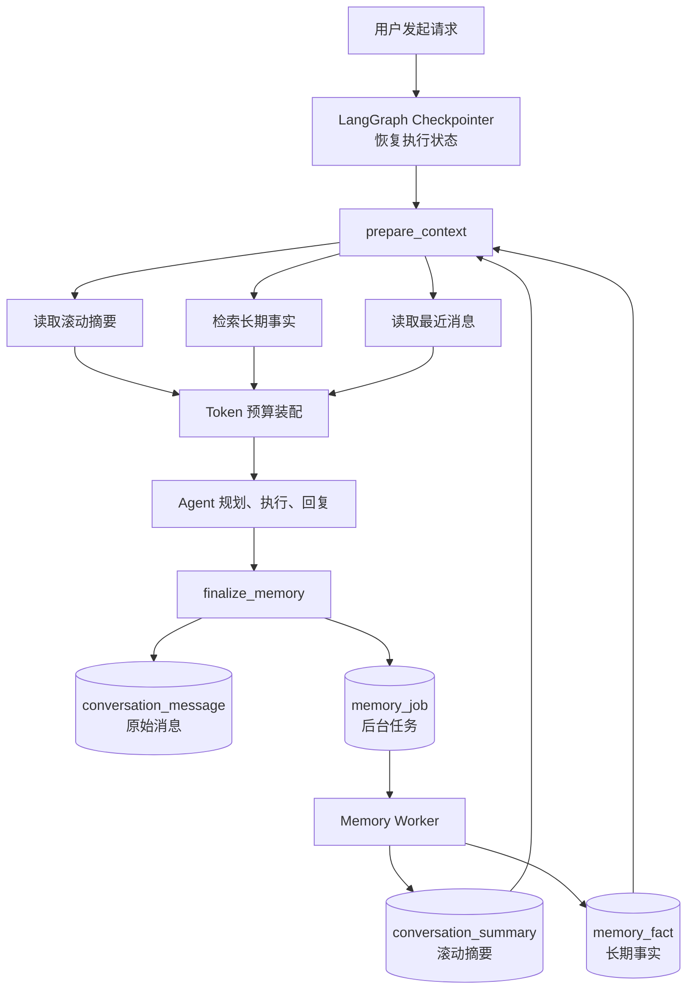
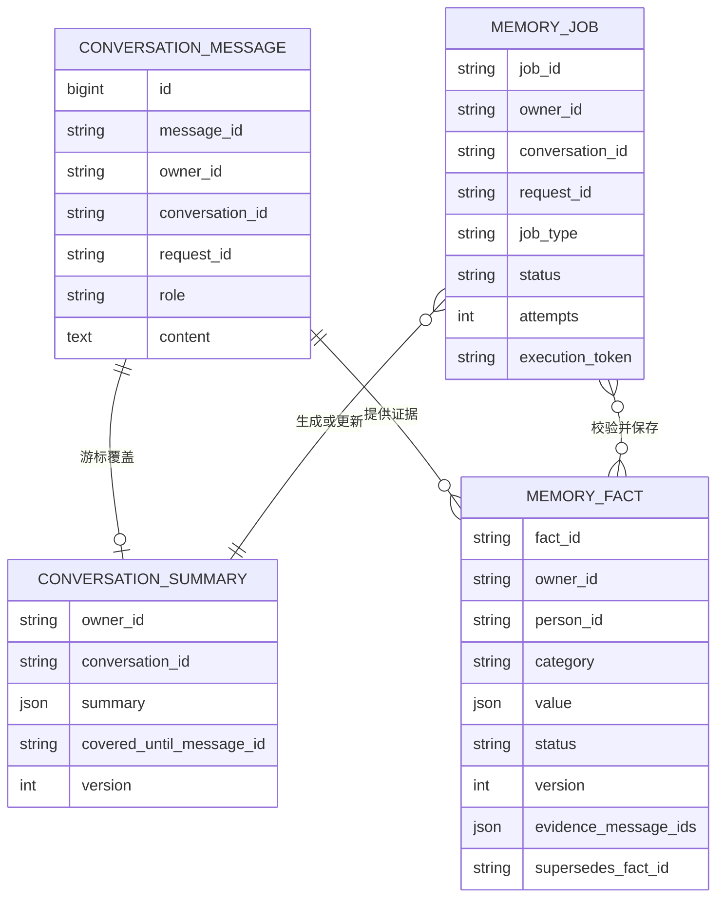

### 现在的三层分别是什么

1. **执行状态记忆**

   LangGraph Checkpointer 保存节点位置、Tool 计划、执行结果和 interrupt 状态，用于中断恢复。

2. **会话记忆**

   `conversation_message` 保存完整原始消息；模型每次只读取最近消息和滚动摘要，不会把全部历史都放进 Prompt。

3. **长期业务记忆**

   `memory_fact` 保存人物资料、关系事实、证据、版本和有效状态，按当前问题检索相关内容。

### 一次请求的完整流程

入口从 [prepare_context.py (line 11)](D:/WorkSpace/Deepseek-harness/WorkSpace/ai-relationship-assistant/backend/agent/nodes/prepare_context.py:11) 开始。

它调用 [context_builder.py (line 18)](D:/WorkSpace/Deepseek-harness/WorkSpace/ai-relationship-assistant/backend/agent/memory/context_builder.py:18)，按照以下优先级装配上下文：

1. 系统规则和当前问题；
2. 未完成计划、interrupt、必要的 Tool 结果；
3. 滚动摘要；
4. 相关长期事实；
5. 从新到旧的最近消息。

每一项都计算 Token。预算不足时会丢弃低优先级内容，但保留当前问题。Tool 结果也会先压缩，防止查询结果数组直接撑爆上下文。

Agent 生成最终回复后进入 [finalize_memory.py (line 21)](D:/WorkSpace/Deepseek-harness/WorkSpace/ai-relationship-assistant/backend/agent/nodes/finalize_memory.py:21)，它依次执行：

- 用稳定的 `message_id` 保存用户消息和助手回复；
- 从成功的 Tool 结果提取长期事实候选；
- 登记摘要任务；
- 有事实候选时登记事实持久化任务；
- 更新 Checkpoint 中的小型最近消息窗口。

### 为什么需要后台任务

摘要需要调用大模型，事实写入还涉及 PostgreSQL 和 Neo4j 校验。如果全部放在主请求里，用户会一直等待，而且摘要失败可能错误地导致业务 Tool 重试。

现在 [memory_job_store.py (line 20)](D:/WorkSpace/Deepseek-harness/WorkSpace/ai-relationship-assistant/backend/db/memory_job_store.py:20) 使用 `memory_job` 表保存任务，[worker.py (line 65)](D:/WorkSpace/Deepseek-harness/WorkSpace/ai-relationship-assistant/backend/agent/memory/worker.py:65) 在后台消费。

它支持：

- 幂等任务 ID；
- `FOR UPDATE SKIP LOCKED` 多实例并发抢占；
- `execution_token` 防止过期 Worker 覆盖新 Worker；
- 失败指数退避；
- `running` 超时重领；
- 重试耗尽后进入终态；
- 全部更新携带 `owner_id`，保证租户隔离。

服务启动时由 [main.py (line 37)](D:/WorkSpace/Deepseek-harness/WorkSpace/ai-relationship-assistant/backend/main.py:37) 启动 Worker，关闭连接池前先安全停止 Worker。

### 摘要什么时候生成

逻辑位于 [summary_pipeline.py (line 46)](D:/WorkSpace/Deepseek-harness/WorkSpace/ai-relationship-assistant/backend/agent/memory/summary_pipeline.py:46)。

默认配置是：

- 新增消息达到 `12` 条，也就是大约 `6` 轮完整对话后生成摘要；
- 一次最多处理 `40` 条消息；
- 只处理完整的 `user → assistant` 组合；
- 批次被截断在 user 消息后时，该消息留给下一批；
- 使用 `covered_until_message_id` 维护摘要游标；
- 更新时同时校验旧游标和旧版本，避免并发 Worker 覆盖新摘要。

模型必须返回固定结构：

- 用户目标；
- 已确认人物；
- 已确认关系；
- 重要决定；
- 待解决问题；
- 未完成任务；
- 不确定信息。

每一项都必须引用真实的 `evidence_message_ids`。模型伪造消息 ID、增加未知字段或者返回超长内容时，摘要不会入库，游标也不会前进。

### 长期事实如何产生

提取逻辑在 [fact_pipeline.py (line 27)](D:/WorkSpace/Deepseek-harness/WorkSpace/ai-relationship-assistant/backend/agent/memory/fact_pipeline.py:27)。

当前只信任成功写操作产生的确定性事实：

- `add_person`
- `update_person`
- `add_relation`

例如用户让 Agent 新增张三，Tool 确实成功返回 `person_id` 后，系统才能生成张三的人物资料事实。

系统不会仅凭用户聊天或模型推断生成 active 事实，也不会自动把 `note` 这类自由文本写进长期客户画像。

事实最终由 [conversation_memory_store.py (line 34)](D:/WorkSpace/Deepseek-harness/WorkSpace/ai-relationship-assistant/backend/db/conversation_memory_store.py:34) 校验和保存：

- 人物必须属于当前 `owner_id`；
- 证据消息必须属于当前用户和会话；
- 相同请求重试不会重复写；
- 同一人物、同一类别的事实按版本递增；
- 新事实激活后，旧事实变为 `superseded`；
- 旧数据保留用于审计。

检索时只返回：

- `active` 状态；
- 尚未过期；
- 证据仍然存在；
- 人物在 Neo4j 中仍属于当前用户；
- 当前类别的最新版本。

目前使用中文字符和二元组进行小数据量相关性排序。以后换成向量检索时，向量库只负责召回 `fact_id`，仍然必须回 PostgreSQL 检查 owner、状态、版本和证据。

### 建议你的代码阅读顺序

1. [prepare_context.py (line 11)](D:/WorkSpace/Deepseek-harness/WorkSpace/ai-relationship-assistant/backend/agent/nodes/prepare_context.py:11)：本轮记忆从哪里进入 Agent。
2. [context_builder.py (line 18)](D:/WorkSpace/Deepseek-harness/WorkSpace/ai-relationship-assistant/backend/agent/memory/context_builder.py:18)：如何控制 Token 和上下文优先级。
3. [finalize_memory.py (line 21)](D:/WorkSpace/Deepseek-harness/WorkSpace/ai-relationship-assistant/backend/agent/nodes/finalize_memory.py:21)：最终回复后保存什么。
4. [fact_pipeline.py (line 27)](D:/WorkSpace/Deepseek-harness/WorkSpace/ai-relationship-assistant/backend/agent/memory/fact_pipeline.py:27)：哪些 Tool 结果能成为事实。
5. [memory_job_store.py (line 20)](D:/WorkSpace/Deepseek-harness/WorkSpace/ai-relationship-assistant/backend/db/memory_job_store.py:20)：后台任务如何抢占和恢复。
6. [worker.py (line 65)](D:/WorkSpace/Deepseek-harness/WorkSpace/ai-relationship-assistant/backend/agent/memory/worker.py:65)：任务如何分发到摘要或事实管道。
7. [summary_pipeline.py (line 46)](D:/WorkSpace/Deepseek-harness/WorkSpace/ai-relationship-assistant/backend/agent/memory/summary_pipeline.py:46)：摘要游标、证据和并发控制。
8. [conversation_memory_store.py (line 34)](D:/WorkSpace/Deepseek-harness/WorkSpace/ai-relationship-assistant/backend/db/conversation_memory_store.py:34)：最终 PostgreSQL 数据一致性规则。

### 验证结果

- Python 全量编译通过；
- 现有 `14` 个测试全部通过；
- 上下文装配冒烟验证通过；
- 长期事实提取冒烟验证通过；
- PostgreSQL 已创建并验证 `memory_job` 等六张业务表；
- PostgreSQL 已成功解析任务抢占 SQL；
- 没有新增测试文件。

目前还有三个明确的后续升级点：

- 使用模型官方 tokenizer 替换保守 Token 估算；
- 接入向量召回，替换当前小数据量相关性排序；
- 把消息保存和任务登记合并成真正的事务 Outbox，消除“消息已保存但任务登记失败”的极小窗口。

当前版本已经可以完整演示三层记忆、Token 控制、滚动摘要、事实证据、版本管理以及后台任务容灾。

16:09

新增的代码太多了，你帮我仔细梳理一下，我应该怎么阅读，让我完整的理解三层记忆、Token 控制、滚动摘要、事实证据、版本管理以及后台任务容灾 这些功能

16:25

用时 40秒

先建立一个总认识：这套代码不是六个相互独立的功能，而是一条完整链路。

> **LangGraph Checkpointer 记住“任务执行到哪里”，会话记忆记住“聊过什么”，长期事实记住“哪些业务信息可以被相信”。Token 控制负责决定本轮拿哪些内容给模型，后台任务负责把耗时的摘要和事实维护移出主链路。**

````

````

## 一、先理解“三层记忆”到底是哪三层

不要把“最近消息、摘要、长期事实”简单理解成三张表。本项目的分层是：

| 层次                 | 保存内容                                 | 解决的问题               | 存储位置                 |
| -------------------- | ---------------------------------------- | ------------------------ | ------------------------ |
| 第一层：执行状态记忆 | 当前节点、Tool 计划、interrupt、执行结果 | 服务重启后如何继续执行   | LangGraph Checkpointer   |
| 第二层：会话记忆     | 最近消息、原始消息、滚动摘要             | 用户之前聊过什么         | PostgreSQL               |
| 第三层：长期业务记忆 | 人物资料、关系事实、证据、版本           | 哪些客户信息可以长期使用 | PostgreSQL `memory_fact` |

Token 控制不是第四层，它是三层记忆进入模型前的“门卫”。

后台任务也不是记忆层，它是维护摘要和长期事实的执行机制。

------

# 二、第一遍阅读：只看一条请求怎么流动

第一遍不要进入 SQL，不要研究所有接口。只看以下四个文件：

1. [prepare_context.py (line 11)](D:/WorkSpace/Deepseek-harness/WorkSpace/ai-relationship-assistant/backend/agent/nodes/prepare_context.py:11)
2. [context_builder.py (line 18)](D:/WorkSpace/Deepseek-harness/WorkSpace/ai-relationship-assistant/backend/agent/memory/context_builder.py:18)
3. [generate_response.py](D:/WorkSpace/Deepseek-harness/WorkSpace/ai-relationship-assistant/backend/agent/nodes/generate_response.py)
4. [finalize_memory.py (line 21)](D:/WorkSpace/Deepseek-harness/WorkSpace/ai-relationship-assistant/backend/agent/nodes/finalize_memory.py:21)

把一次请求理解成：

```
用户问题
  ↓
prepare_context：准备本轮可以使用的记忆
  ↓
Agent 识别意图、规划、执行 Tool
  ↓
generate_response：生成最终回复
  ↓
finalize_memory：保存本轮消息，创建摘要/事实任务
```

## 用一个具体例子贯穿整个流程

用户第一次说：

```
张三是我的同事，他喜欢钓鱼。
```

### 第一步：prepare_context

系统根据当前登录用户得到：

```
owner_id = "user_001"
conversation_id = "default"
current_input = "张三是我的同事，他喜欢钓鱼。"
```

然后读取：

- 这个会话已有的滚动摘要；
- 当前问题可能相关的长期事实；
- 最近几条聊天消息；
- Checkpoint 中未完成的执行信息。

第一次对话时，这些基本为空，最后模型上下文可能只有：

```
[
    {
        "role": "user",
        "content": "张三是我的同事，他喜欢钓鱼。"
    }
]
```

### 第二步：Agent 执行

Agent 可能规划：

```
find_person
    ↓
add_person
    ↓
add_relation
```

执行成功后，`tool_results` 中包含张三的真实 `person_id` 和关系信息。

### 第三步：生成回复

例如：

```
已经添加张三，并记录他是你的同事。
```

### 第四步：finalize_memory

它会：

1. 保存用户原话；
2. 保存最终助手回复；
3. 从成功 Tool 结果中提取事实候选；
4. 创建摘要任务；
5. 创建事实保存任务。

所以这一轮结束后，主请求已经完成，而摘要和长期事实由后台处理。

------

# 三、第二遍阅读：先看领域模型，不看实现

打开 [models.py](D:/WorkSpace/Deepseek-harness/WorkSpace/ai-relationship-assistant/backend/agent/memory/models.py)。

你只需要先理解五个对象。

## 1. MemoryMessage：一条原始消息

```
MemoryMessage(
    message_id="...",
    owner_id="user_001",
    conversation_id="default",
    request_id="req_001",
    role=MemoryRole.USER,
    content="张三是我的同事",
)
```

几个 ID 的职责：

| 字段              | 含义                                       |
| ----------------- | ------------------------------------------ |
| `message_id`      | 唯一标识某条消息，也用于摘要游标和事实证据 |
| `request_id`      | 唯一标识一次 HTTP 请求，用于请求重试幂等   |
| `conversation_id` | 表示消息属于哪个业务会话                   |
| `owner_id`        | 表示数据属于哪个登录用户                   |

一次正常的完整请求会产生两条消息：

```
request_id=req_001, role=user
request_id=req_001, role=assistant
```

数据库唯一约束是：

```
owner_id + request_id + role
```

所以相同请求重试时，不会重复插入消息。

## 2. ConversationSummary：滚动摘要

```
ConversationSummary(
    owner_id="user_001",
    conversation_id="default",
    content={...},
    covered_until_message_id="message_012",
    version=3,
)
```

关键字段：

- `content`：结构化摘要；
- `covered_until_message_id`：已经总结到哪条消息；
- `version`：摘要版本，用于并发控制。

它表达的是：

```
message_001 到 message_012 已经被压缩进摘要。
下一次从 message_013 开始继续总结。
```

## 3. MemoryFact：长期事实

```
MemoryFact(
    fact_id="...",
    person_id="person_zhangsan",
    category="person_profile",
    value={
        "name": "张三",
        "occupation": "销售",
        "hobbies": ["钓鱼"]
    },
    status=MemoryFactStatus.ACTIVE,
    version=1,
    evidence_message_ids=["message_001"],
)
```

它不是一段聊天，而是结构化业务事实。

## 4. MemoryJob：后台任务

```
MemoryJob(
    job_type=MemoryJobType.SUMMARY,
    owner_id="user_001",
    conversation_id="default",
    request_id="req_001",
    attempts=1,
    execution_token="...",
)
```

目前有两种任务：

```
SUMMARY = "summary"
PERSIST_FACTS = "persist_facts"
```

## 5. ContextBundle：最终发送给模型的上下文包

```
ContextBundle(
    messages=[...],
    summary={...},
    memories=[...],
    compact_execution={...},
    stats=ContextStats(...),
)
```

这个对象把“数据库保存了什么”和“模型本轮能看到什么”分开。

这是整个三层记忆最关键的设计之一：

> PostgreSQL 可以保存几万条历史消息，但模型本轮只看到经过预算筛选的一小部分。

------

# 四、Token 控制应该怎样阅读

相关文件：

1. [token_budget.py](D:/WorkSpace/Deepseek-harness/WorkSpace/ai-relationship-assistant/backend/agent/memory/token_budget.py)
2. [context_builder.py (line 18)](D:/WorkSpace/Deepseek-harness/WorkSpace/ai-relationship-assistant/backend/agent/memory/context_builder.py:18)
3. [context_selector.py](D:/WorkSpace/Deepseek-harness/WorkSpace/ai-relationship-assistant/backend/agent/memory/context_selector.py)
4. [llm.py (line 30)](D:/WorkSpace/Deepseek-harness/WorkSpace/ai-relationship-assistant/backend/services/llm.py:30)

## 1. 先算可用输入预算

当前配置：

```
AGENT_MAX_INPUT_TOKENS=12000
AGENT_RESERVED_OUTPUT_TOKENS=2000
AGENT_CONTEXT_SAFETY_TOKENS=1000
```

计算方式：

```
可用输入预算
= 最大输入上限
- 输出预留
- 安全余量

= 12000 - 2000 - 1000
= 9000 Token
```

含义是：

- 最多允许输入约 9000；
- 给模型回复预留 2000；
- 再留出 1000，容纳估算误差和协议结构。

## 2. 什么内容必须保留

`build_context_bundle()` 首先计算固定内容：

```
系统规则
当前用户输入
当前未完成执行状态
```

这些内容不能因为历史太长而被裁掉。

如果用户当前输入自己就超过预算：

```
current_input_over_budget = True
```

系统不会偷偷截断用户原话，而是把问题暴露给上层处理。

## 3. 什么内容可以按预算选择

按顺序装入：

```
滚动摘要
    ↓
相关长期事实
    ↓
最近消息，从新到旧
```

某项装不下时就跳过。

例如剩余预算只有 1000：

```
摘要需要 400 Token       → 保留
相关事实需要 300 Token   → 保留
最新两条消息需要 250     → 保留
再上一条消息需要 200     → 放不下，丢弃
```

## 4. 为什么还要在 llm.chat 再检查一次

`prepare_context` 只能计算共享上下文。

进入具体节点后，还会增加：

- 意图识别 Prompt；
- 规划 Prompt；
- Tool 定义；
- 重规划反馈；
- 回复生成 Prompt。

所以 [llm.py (line 30)](D:/WorkSpace/Deepseek-harness/WorkSpace/ai-relationship-assistant/backend/services/llm.py:30) 在真正发送前再计算一次最终 Token。

这是两道防线：

```
第一道：Context Builder 控制记忆大小
第二道：LLM Service 控制最终 HTTP 请求大小
```

## 5. 当前 Token 计数的局限

当前使用的是保守估算器：

- 中文字符大约按一个 Token；
- ASCII 字符大约按四分之一个 Token；
- 每条消息增加结构开销。

它的作用是稳定、可调试、避免明显超限。

它还不是对应模型的精确 tokenizer。`llm.py` 会记录供应商返回的真实 Token 数，用于以后校准。

------

# 五、滚动摘要完整逻辑

重点阅读：

1. [summary_pipeline.py (line 46)](D:/WorkSpace/Deepseek-harness/WorkSpace/ai-relationship-assistant/backend/agent/memory/summary_pipeline.py:46)
2. [conversation_memory_store.py (line 34)](D:/WorkSpace/Deepseek-harness/WorkSpace/ai-relationship-assistant/backend/db/conversation_memory_store.py:34)

## 1. 为什么叫“滚动摘要”

假设现在有 20 轮历史。

第一次摘要：

```
旧摘要：空
新增消息：第 1～6 轮
生成摘要 V1
游标移动到第 6 轮助手消息
```

第二次摘要：

```
旧摘要：V1
新增消息：第 7～12 轮
生成摘要 V2
游标移动到第 12 轮助手消息
```

模型永远只处理：

```
旧摘要 + 游标后的一小批新消息
```

而不是每次重新读取全部聊天。

## 2. 摘要什么时候触发

当前默认：

```
AGENT_SUMMARY_MIN_MESSAGES=12
```

一轮有两条消息：

```
user + assistant
```

所以通常积累到六轮完整对话后开始摘要。

每轮完成都会登记摘要任务，但 Worker 会检查：

```
if len(complete_messages) < min_messages:
    return False
```

不足阈值时不调用大模型。

## 3. 为什么游标用 message_id

摘要保存：

```
covered_until_message_id
```

但 `message_id` 是 UUID，不能这样判断：

```
WHERE message_id > :cursor
```

UUID 大小不代表消息顺序。

所以 Repository 的逻辑是：

```
message_id
    ↓
查询对应自增 id
    ↓
WHERE id > cursor_id
    ↓
ORDER BY id ASC
```

这是 [load_after_cursor](D:/WorkSpace/Deepseek-harness/WorkSpace/ai-relationship-assistant/backend/db/conversation_memory_store.py) 解决的问题。

## 4. 为什么只处理完整 user/assistant 轮次

假设 SQL 一次最多读取五条：

```
user1
assistant1
user2
assistant2
user3
```

最后的 `user3` 没有对应助手回复。

系统只摘要前四条：

```
user1
assistant1
user2
assistant2
```

`user3` 留给下次。

否则摘要游标可能移动到 `user3`，导致后续 `assistant3` 永远无法和它组成完整一轮。

## 5. 摘要为什么必须结构化

摘要不是任意一段文字，而是固定七个字段：

```
{
    "user_goals": [],
    "confirmed_people": [],
    "confirmed_relations": [],
    "important_decisions": [],
    "open_questions": [],
    "unfinished_tasks": [],
    "uncertainties": []
}
```

每一项必须是：

```
{
    "text": "张三是用户的同事",
    "evidence_message_ids": ["message_001"]
}
```

这样可以区分：

```
已经确认：张三是同事
尚不确定：张三可能准备换工作
```

## 6. 模型输出之后为什么还要校验

模型可能返回：

```
{
    "confirmed_people": [
        {
            "text": "张三是公司总经理",
            "evidence_message_ids": ["模型自己编的ID"]
        }
    ]
}
```

`validate_summary()` 会检查：

- 是否只有规定字段；
- 每个字段是不是数组；
- text 是否为空或过长；
- evidence 是否存在；
- evidence 是否属于允许的消息集合；
- 总摘要是否超过长度上限。

校验失败时：

```
不保存摘要
不移动游标
后台任务进入失败重试
```

## 7. 两个 Worker 同时摘要怎么办

两个 Worker 可能同时读到：

```
旧版本 version=3
旧游标 message_012
```

Worker A 先保存成功：

```
version=4
cursor=message_024
```

Worker B 保存时仍要求：

```
version = 3
AND covered_until_message_id = message_012
```

此时条件不成立，更新失败。

所以较慢的旧摘要不会覆盖较新的摘要。

这就是：

```
version + expected_cursor 乐观锁
```

------

# 六、事实证据怎样理解

重点阅读：

1. [fact_pipeline.py (line 27)](D:/WorkSpace/Deepseek-harness/WorkSpace/ai-relationship-assistant/backend/agent/memory/fact_pipeline.py:27)
2. `save_candidates()`，位于 [conversation_memory_store.py (line 34)](D:/WorkSpace/Deepseek-harness/WorkSpace/ai-relationship-assistant/backend/db/conversation_memory_store.py:34)

## 1. 为什么不直接从用户原话抽事实

用户说：

```
听说张三可能准备离职。
```

这句话可能是：

- 用户猜测；
- 转述；
- 已经过时；
- 对方隐私；
- 模型理解错误。

如果模型直接写入：

```
张三准备离职
```

客户画像就被污染了。

所以当前版本采用更保守的逻辑：

> 只有成功执行的确定性写 Tool 才能自动产生 active 事实。

## 2. 当前哪些 Tool 会产生候选

目前支持：

```
add_person
update_person
add_relation
```

必须同时满足：

```
record["status"] == "SUCCESS"
result["success"] is True
```

查询 Tool、失败 Tool、跳过 Tool 都不会产生事实。

## 3. 为什么还需要证据 message_id

候选事实例如：

```
MemoryWriteCandidate(
    person_id="person_001",
    category="person_profile",
    value={
        "name": "张三",
        "occupation": "销售"
    },
    evidence_message_ids=["message_user_001"],
)
```

以后如果面试官问：

> 你怎么防止模型生成错误的客户事实？

你可以回答：

> 每条长期事实必须绑定原始用户消息证据。事实落库前会检查证据消息是否存在、是否属于当前登录用户和当前会话。模型返回一个不存在的 message_id 无法通过 Repository 校验。

## 4. 为什么排除 note

`note` 是自由文本，例如：

```
上次喝酒时听说他可能准备跳槽
欠我五百块
他妻子是我同学
```

它可能包含敏感、含糊、过时信息。

所以确定性资料只提取允许字段，例如：

```
name
gender
birth_year
occupation
education
hobbies
personality
tags
```

`note` 不会自动变成 active 长期事实。

## 5. Repository 还要再次检查什么

即使候选来自成功 Tool，也不能直接 INSERT。

Repository 继续校验：

```
owner_id 是否存在
person_id 是否属于 owner
evidence 消息是否属于 owner
evidence 消息是否属于当前 conversation
value 是否为非空结构
confidence 是否在 0～1
同一请求是否提交了不同内容
```

这体现了一个重要原则：

> 模型和上游节点只能提出候选，数据仓储才拥有最终写入权限。

------

# 七、事实版本管理怎样工作

假设第一次保存张三资料：

```
person_id = p_zhangsan
category = person_profile
version = 1
status = active
occupation = Java 开发
```

后来用户更新：

```
张三现在转行做销售了。
```

Tool 成功后产生新候选。

Repository 会：

1. 给新事实分配 `version=2`；
2. 新事实状态设为 `active`；
3. 找到原来的 active 事实；
4. 把旧事实改成 `superseded`；
5. 设置旧事实的 `valid_to`；
6. 新事实记录 `supersedes_fact_id`。

最后得到：

| 版本 | 职业      | 状态       | 有效期               |
| ---- | --------- | ---------- | -------------------- |
| V1   | Java 开发 | superseded | 创建时间～被替代时间 |
| V2   | 销售      | active     | 创建时间～现在       |

旧数据不物理删除，因为以后可能需要回答：

```
张三以前做什么？
这条资料是谁在什么时候修改的？
为什么系统当时给出了这个建议？
```

## 为什么需要数据库锁

两个请求可能同时修改张三：

```
请求 A：张三转销售
请求 B：张三转产品
```

两个线程如果同时查询最大版本，都可能得到：

```
MAX(version) = 1
```

然后都准备插入 `version=2`。

所以代码使用事务级 advisory lock：

```
owner_id + person_id + category
```

同一个人物、同一事实类别的版本分配串行执行。

不同人物仍然可以并发处理。

## 查询时为什么只取最新 active

检索 SQL 会按照：

```
person_id + category
```

选择最新版本，只返回：

```
status = active
valid_to 尚未过期
证据消息仍然存在
人物仍属于当前 owner
```

旧版本保留审计，但不会继续进入模型上下文。

------

# 八、后台任务容灾是怎样实现的

重点阅读：

1. [memory_job_store.py (line 20)](D:/WorkSpace/Deepseek-harness/WorkSpace/ai-relationship-assistant/backend/db/memory_job_store.py:20)
2. [worker.py (line 65)](D:/WorkSpace/Deepseek-harness/WorkSpace/ai-relationship-assistant/backend/agent/memory/worker.py:65)
3. [003_memory_job.sql (line 6)](D:/WorkSpace/Deepseek-harness/WorkSpace/ai-relationship-assistant/backend/db/migrations/003_memory_job.sql:6)
4. [main.py (line 37)](D:/WorkSpace/Deepseek-harness/WorkSpace/ai-relationship-assistant/backend/main.py:37)

## 1. 为什么不能直接在 finalize_memory 中调用摘要模型

如果主请求直接生成摘要：

```
业务 Tool 已经成功
    ↓
调用摘要模型
    ↓
摘要模型超时
    ↓
HTTP 请求失败
    ↓
前端重试整个 Agent
```

这可能导致业务 Tool 被错误重试。

所以正确边界是：

```
主链负责业务结果
后台任务负责派生记忆
```

摘要失败只能重试摘要，不能回到 `execute_tools`。

## 2. memory_job 的状态

```
pending → running → succeeded
                  ↘ failed → running
```

含义：

| 状态        | 含义                         |
| ----------- | ---------------------------- |
| `pending`   | 已登记，等待 Worker          |
| `running`   | 某个 Worker 已获得执行权     |
| `succeeded` | 已完成                       |
| `failed`    | 本次尝试失败，等待退避后重试 |

## 3. 多个服务实例怎样避免重复消费

Worker 抢任务时使用：

```
FOR UPDATE SKIP LOCKED
```

假设有三个 API 实例：

```
Worker A 锁定任务 1
Worker B 查询时跳过任务 1，拿到任务 2
Worker C 查询时跳过任务 1、2，拿到任务 3
```

数据库锁只覆盖“抢任务”的短事务。

真正调用 LLM、Neo4j 时不持有数据库锁。

## 4. execution_token 为什么重要

Worker A 抢到任务：

```
status = running
execution_token = token_A
```

Worker A 卡住超过五分钟，Worker B 重新抢占：

```
execution_token = token_B
```

后来 Worker A 恢复，试图写成功：

```
WHERE execution_token = token_A
```

数据库中的 Token 已经是 `token_B`，所以 Worker A 更新失败。

这叫 fencing token，它解决的是：

> 旧 Worker 虽然恢复了，但已经失去任务所有权，不能覆盖新 Worker 的结果。

## 5. 不同崩溃位置会发生什么

### 场景一：任务还没被 Worker 抢到，服务崩溃

数据库仍然是：

```
pending
```

新服务启动后继续消费。

### 场景二：任务变成 running，Worker 还没执行就崩溃

超过租约时间后：

```
running 任务被重新抢占
生成新的 execution_token
```

### 场景三：摘要模型调用失败

Worker：

```
status = failed
记录 last_error
设置 available_at
```

稍后指数退避重试。

### 场景四：旧 Worker 和新 Worker 同时返回

只有持有当前 `execution_token` 的 Worker 可以修改状态。

### 场景五：重试次数耗尽时 Worker 崩溃

下次扫描会把过期并且达到最大尝试次数的任务收敛为终态 `failed`，避免永远停在 `running`。

## 6. 为什么每个任务 ID 都是稳定的

任务 ID 根据下面的信息生成：

```
owner_id
conversation_id
request_id
job_type
```

使用 UUID5。

所以同一个请求重复进入 `finalize_memory`：

```
第一次创建 summary 任务
第二次生成相同 job_id
数据库唯一约束阻止重复插入
```

------

# 九、Ports、Runtime、Repository 为什么看起来很绕

这部分最容易让你感觉“代码突然变多了”。

## ports.py：定义能力

[ports.py](D:/WorkSpace/Deepseek-harness/WorkSpace/ai-relationship-assistant/backend/agent/memory/ports.py) 只回答：

```
消息仓储需要提供哪些方法？
摘要仓储需要提供哪些方法？
事实仓储需要提供哪些方法？
任务仓储需要提供哪些方法？
```

它不关心 PostgreSQL。

例如：

```
class MessageStore(Protocol):
    def load_recent(...): ...
    def load_after_cursor(...): ...
    def save_turn(...): ...
```

## conversation_memory_store.py：PostgreSQL 实现

[conversation_memory_store.py (line 34)](D:/WorkSpace/Deepseek-harness/WorkSpace/ai-relationship-assistant/backend/db/conversation_memory_store.py:34) 回答：

```
这些能力具体怎样使用 SQL 实现？
```

## runtime.py：把实现注入节点

[runtime.py](D:/WorkSpace/Deepseek-harness/WorkSpace/ai-relationship-assistant/backend/agent/memory/runtime.py) 保存当前进程真正使用的实现：

```
MemoryRuntime(
    message_store=PostgresConversationMemoryStore(),
    summary_store=PostgresConversationMemoryStore(),
    long_term_store=PostgresConversationMemoryStore(),
    job_store=PostgresMemoryJobStore(),
    token_counter=ConservativeTokenCounter(),
)
```

节点只调用：

```
runtime.message_store.save_turn(...)
```

不需要知道背后是不是 PostgreSQL。

这让你以后可以替换：

```
PostgreSQL 关键词检索
    ↓
Elasticsearch
    ↓
pgvector
    ↓
Milvus
```

而不用修改 LangGraph 节点。

------

# 十、三张记忆表的关系

````

````

你可以这样记：

```
conversation_message：原始证据
conversation_summary：压缩后的会话理解
memory_fact：可长期使用的业务结论
memory_job：维护摘要和事实的可靠任务
```

------

# 十一、建议你的实际阅读顺序

每完成一个阶段，先能回答后面的问题，再进入下一阶段。

## 阶段一：30 分钟，只看数据模型

阅读：

- `models.py`
- `ports.py`
- `runtime.py`

你需要能回答：

1. `request_id` 和 `message_id` 有什么区别？
2. `ConversationSummary` 为什么需要游标？
3. `MemoryFact` 为什么需要 evidence？
4. `MemoryJob` 为什么需要 execution_token？
5. Protocol 和 Repository 有什么区别？

## 阶段二：45 分钟，看模型上下文怎么构建

阅读：

- `prepare_context.py`
- `context_builder.py`
- `token_budget.py`
- `context_selector.py`
- `services/llm.py`

你需要能回答：

1. 为什么数据库保存所有消息，模型却只看一部分？
2. 9000 Token 的输入预算怎么得到？
3. 哪些内容不能被裁掉？
4. 为什么发送模型前还要做第二次 Token 检查？
5. `summary_required` 在什么情况下变成 `True`？

## 阶段三：30 分钟，看一次对话怎么落库

阅读：

- `finalize_memory.py`
- `save_turn()`
- `_insert_message_once()`

你需要能回答：

1. 为什么一轮保存两条消息？
2. HTTP 重试为什么不会重复插入？
3. 为什么 message_id 使用稳定 UUID5？
4. 为什么先保存原始消息，再创建事实任务？

## 阶段四：45 分钟，看滚动摘要

阅读：

- `run_summary_job()`
- `_complete_turn_prefix()`
- `_fit_summary_prefix()`
- `validate_summary()`
- `save_if_cursor_matches()`

你需要能回答：

1. 摘要什么时候生成？
2. 为什么不能使用 request_id 或创建时间作为游标？
3. 为什么只处理完整 user/assistant 对？
4. 模型伪造 evidence 时会发生什么？
5. 两个 Worker 同时更新摘要时谁成功？

## 阶段五：45 分钟，看长期事实

阅读：

- `extract_fact_candidates()`
- `_person_profile_candidate()`
- `_relationship_candidate()`
- `save_candidates()`
- `search()`

你需要能回答：

1. 为什么只从成功 Tool 提取事实？
2. 为什么 note 不自动进入 active？
3. 为什么候选人物还要再次校验 owner？
4. 新事实怎样替代旧版本？
5. 为什么旧事实不能直接删除？

## 阶段六：45 分钟，看后台容灾

阅读：

- `memory_job_store.py`
- `worker.py`
- `main.py` 的 lifespan

你需要能回答：

1. 为什么使用短事务抢占？
2. `SKIP LOCKED` 解决什么问题？
3. `execution_token` 和数据库状态分别解决什么问题？
4. running 任务超时后怎样恢复？
5. 为什么摘要失败不能重新执行 Tool？

------

# 十二、当前实现的边界，你也要理解

当前版本有几个有意保留的边界。

## 1. 中断信息主要保存在 Checkpointer

只有经过：

```
generate_response → finalize_memory
```

的完整轮次才会写入 `conversation_message`。

`request_confirmation` 和 `ask_clarification` 暂停时，状态主要保存在 LangGraph Checkpointer。

如果用户取消操作并直接进入 `END`，当前不会经过 `finalize_memory` 保存这一轮完整消息。

## 2. 低置信度事实确认流程还没有完整前端入口

Repository 已支持：

```
pending_confirmation
active
superseded
rejected
```

但当前提取器只自动产生成功 Tool 对应的确定性事实。

自然语言推断出来的低置信事实，目前不会主动写入事实表，也还没有“确认这条客户事实”的完整前端流程。

## 3. 当前长期事实检索适用于小规模数据

当前从 PostgreSQL 取有限候选，再使用中文字符和二元组排序。

客户事实规模扩大后，应改成：

```
向量库召回 fact_id
    ↓
回查 PostgreSQL
    ↓
校验 owner、状态、版本、证据
    ↓
返回模型
```

## 4. 消息保存和任务登记还不是同一个事务

当前顺序是：

```
保存 conversation_message
    ↓
登记 memory_job
```

如果两者之间数据库临时故障，可能出现：

```
消息已经保存
事实任务没有登记成功
```

现在会记录错误，后续摘要可以追上，但事实任务需要补偿。

更严格的企业级方案是 Transactional Outbox：在同一个 PostgreSQL 事务中保存消息和任务记录。

你现在最适合先从 `models.py → prepare_context → finalize_memory` 这条最短路径读起。等你能独立描述“一次请求怎样读取记忆、怎样保存记忆”，再进入摘要游标、事实版本和后台 Worker。这样每个复杂模块都有明确的上下游，不会只看到一堆孤立的方法。